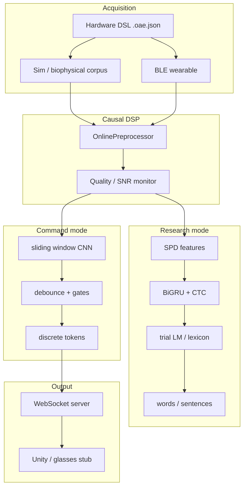

# OpenAlterEgo v0.2

Open-source, AlterEgo-style **silent speech** stack: multichannel facial EMG acquisition, causal DSP, sliding-window classification, and WebSocket output for XR clients — plus a research path for **Gowda/emg2speech-style** SPD + CTC decoding on real silent-speech corpora.

> **Status (June 2026):** The Python stack is functional end-to-end for command-mode (sim → train → serve) and validated on real Gowda OSF data (~**6.8%** trial-LM WER on 124-word small vocab). Custom wearable firmware and open-vocabulary dictation are active research tracks, not shipping products.

**Quick links:** [Install](#install) · [Command-mode demo](#command-mode-demo) · [Gowda research loop](#gowda-research-loop) · [Docs map](#documentation-map) · [Literature](#literature-papers) · [Hardware tiers](#hardware-path) · [Contributing](#development)

---

## Table of contents

- [What problem this solves](#what-problem-this-solves)
- [Two modes in one repository](#two-modes-in-one-repository)
- [Architecture](#architecture)
- [Highlights & validation results](#highlights-validation-results)
- [Install](#install)
- [Command-mode demo](#command-mode-demo)
- [Gowda research loop](#gowda-research-loop)
- [Session data format](#session-data-format)
- [Simulation & sim2real](#simulation-sim2real)
- [Realtime WebSocket API](#realtime-websocket-api)
- [External datasets](#external-datasets)
- [Repository layout](#repository-layout)
- [Python package map](#python-package-map)
- [Documentation map](#documentation-map)
- [Literature & papers](#literature-papers)
- [Hardware path](#hardware-path)
- [Parameter defaults vs literature](#parameter-defaults-vs-literature)
- [Implementation status](#implementation-status)
- [Troubleshooting](#troubleshooting)
- [Development](#development)
- [Licensing & citation](#licensing)

---

<span id="what-problem-this-solves"></span>
## What problem this solves

**Silent speech interfaces (SSIs)** let people communicate or control devices by articulating words *without audible sound* — muscle activity on the face and neck is picked up by surface EMG electrodes and decoded by ML.

OpenAlterEgo is an **open, reproducible** implementation stack for that pipeline:

| Use case | What you get today |
|----------|-------------------|
| **XR / smart-glasses commands** | Closed vocab (`yes`, `no`, `left`, `right`, `select`, `cancel`) over WebSocket |
| **Per-user wearable tuning** | Profiles, calibration, SNR/motion quality gates, adaptive thresholds |
| **Sim-before-hardware** | Biophysical EMG synthesis + `.oae.json` hardware DSL to de-risk DSP/ML |
| **Paper reproduction** | Gowda OSF small-vocab SPD + CTC + trial LM (~6.8% WER on our harness) |
| **Sim→real research** | Synthetic Gowda corpora, realism ablations, M1 phoneme-synth transfer grid |

This is **research and prototyping software**, not a regulated medical device. See safety notes under [Hardware path](#hardware-path).

---

<span id="two-modes-in-one-repository"></span>
## Two modes in one repository

Most repos pick *either* a product demo *or* a benchmark harness. OpenAlterEgo deliberately hosts **both**, sharing acquisition, DSP, and quality layers:

| | **Command mode** | **Research mode (Gowda)** |
|---|------------------|---------------------------|
| **Goal** | Stable discrete tokens for UI/XR | Sentence-level silent speech (124-word closed lexicon today) |
| **Features** | Band-limited CNN input windows | SPD σ(τ) matrices → `diag_delta` vectors |
| **Model** | 1D CNN / SE-ResNet + softmax | BiGRU + CTC over phonemes |
| **Decode** | Debounce + confidence/SNR gate | Beam search + lexicon Viterbi + trial LM |
| **Typical fs** | 250 Hz, 4–8 ch | 5000 Hz, 31 ch |
| **Train** | `openalterego train --user-id …` | `openalterego analyze gowda-phase6 …` |
| **Serve** | `openalterego serve` → WebSocket tokens | Offline / batch (`decode-utterance`, phase reports) |
| **Sim** | Heuristic or biophysical @ 250 Hz | `sim-dataset --scenario gowda_sv` @ 5 kHz |

**Open-vocabulary north star:** phoneme CTC + personal lexicon/LM, biophysical pretrain, measurable sim→real transfer — design doc: [`docs/19-open-vocab-and-sim2real.md`](docs/19-open-vocab-and-sim2real.md).

---

<span id="architecture"></span>
## Architecture



| Layer | Responsibility | Path |
|-------|----------------|------|
| **Hardware design** | Tiers, BOM, BLE framing, montage specs | [`hardware/`](hardware/README.md) |
| **Hardware DSL** | Validate/resolve/simulate `.oae.json` stacks | [`openalterego/hardware/`](software/python/openalterego/hardware/) |
| **Acquisition** | Packets, BLE client, sim streams | [`openalterego/acquisition/`](software/python/openalterego/acquisition/) |
| **DSP** | Bandpass modes, notch, online quality | [`openalterego/dsp/`](software/python/openalterego/dsp/) |
| **Command ML** | CNN train/infer, user-aware checkpoints | [`openalterego/ml/`](software/python/openalterego/ml/) |
| **Research ML** | SPD, CTC, eval harnesses, sim-transfer | [`openalterego/ml/ctc/`](software/python/openalterego/ml/ctc/) · [`ml/eval/`](software/python/openalterego/ml/eval/) |
| **Simulation** | Heuristic + biophysical MUAP pool, phonology | [`openalterego/sim/`](software/python/openalterego/sim/) |
| **Runtime** | Streaming decode, latency/window tools | [`openalterego/runtime/`](software/python/openalterego/runtime/) |
| **Users** | Profiles, calibration, `collect` | [`openalterego/users/`](software/python/openalterego/users/) |
| **API** | WebSocket hub + JSON protocol | [`openalterego/api/`](software/python/openalterego/api/) |
| **CLI** | Single entrypoint for all workflows | [`openalterego/cli.py`](software/python/openalterego/cli.py) |
| **XR example** | Unity receiver | [`software/unity/OpenAlterEgoReceiver.cs`](software/unity/OpenAlterEgoReceiver.cs) |

---

<span id="highlights-validation-results"></span>
## Highlights & validation results

### Command mode

- **Per-user profiles** — thresholds, baseline SNR, window/stride, EMG mode ([`users/`](software/python/openalterego/users/))
- **Three bandpass modes** — `standard` (1–50 Hz AlterEgo), `clinical` (0.5–8 Hz), `wide` (20–450 Hz, needs high fs)
- **Quality layer** — motion index, SNR estimation, recalibration hints during `serve`
- **160+ pytest tests** — DSP, sim, biophysical perf, users, streaming, WebSocket, hardware DSL

### Gowda / emg2speech benchmark (real OSF EMG)

Primary paper: [Gowda & Miller 2025, arXiv:2502.05762](https://arxiv.org/abs/2502.05762) · Data: [OSF YM5JD](https://doi.org/10.17605/OSF.IO/YM5JD)

| Phase | What we measured | Result | Write-up |
|-------|------------------|--------|----------|
| Import + alignment fix | Correct word boundaries on OSF small vocab | ✅ | [`docs/gowda/validation/02-top30-corrected.md`](docs/gowda/validation/02-top30-corrected.md) |
| CNN baseline | 30-word subset | ~18% val WER | same |
| SPD + CTC (Phase 5) | Full 124-word phoneme CTC | ✅ pipeline | [`docs/gowda/validation/05-phase3-spd-fullvocab.md`](docs/gowda/validation/05-phase3-spd-fullvocab.md) |
| Trial LM (Phase 6) | 4-word sentence decode | **~6.8% test WER** | [`docs/gowda/validation/08-phase6-trial-lm.md`](docs/gowda/validation/08-phase6-trial-lm.md) |
| Sim→real anchor | Biophysical M1 templates + wearable realism | **64–70% anchor WER** (vs ~83% tang sim baseline) | [`docs/gowda/validation/11-phoneme-synth-m1.md`](docs/gowda/validation/11-phoneme-synth-m1.md) |
| Realism ablations | `off` / `wearable` / `tang` probe + transfer | ✅ harness | [`docs/gowda/validation/10-realism-ablations.md`](docs/gowda/validation/10-realism-ablations.md) |

Paper small-vocab reference: **~14% WER** (their GRU+CTC). Our **~6.8%** uses trial-structure LM + corrected import — compare carefully; full gap analysis: [`docs/gowda/openalterego/01-gap-analysis.md`](docs/gowda/openalterego/01-gap-analysis.md).

### Biophysical simulation

Default engine for `sim-dataset`: **Poisson motor-unit pool**, MUAP-shaped impulses, montage forward model, realism presets, Tang SNR auto-calibration (static **~18.9 dB**, motion **~12.7 dB**).

**M1 phoneme synthesizer:** duration priors, templates fit from real EMG, coarticulation, Gowda scripted trials — see [`docs/gowda/validation/11-phoneme-synth-m1.md`](docs/gowda/validation/11-phoneme-synth-m1.md).

---

<span id="install"></span>
## Install

### Prerequisites

| Requirement | Notes |
|-------------|-------|
| **Python 3.10+** | Pinned in [`software/python/.python-version`](software/python/.python-version) |
| **[uv](https://docs.astral.sh/uv/)** | Recommended; lockfile in [`uv.lock`](software/python/uv.lock) |
| **CUDA PyTorch** | Strongly recommended for Gowda CTC (`uv` pulls `cu124` on Windows/Linux) |
| **Rust toolchain** | Optional — only for [`software/python/accel/`](software/python/accel/) SNR extension |

```bash
git clone https://github.com/<your-org>/hardware-open-alter-ego-v0-2.git
cd hardware-open-alter-ego-v0-2/software/python

uv sync --group dev
uv run pytest -q
uv run openalterego --help
```

**Important:** Use `uv run openalterego …` (or activate `.venv`) so CUDA torch and deps match the lockfile. System Python often installs CPU-only torch.

---

<span id="command-mode-demo"></span>
## Command-mode demo

End-to-end **synthetic** loop — no hardware required:

```bash
cd software/python

# 1. User profile
uv run openalterego user create --user-id alice

# 2. Record ~2 min of labeled sim EMG (writes session folder)
uv run openalterego collect sim --out ./session --user-id alice --seconds 120

# 3. Calibrate streaming-aligned threshold + baseline SNR
uv run openalterego calibrate --user-id alice --data ./session --fs 250

# 4. Realtime decode → WebSocket
uv run openalterego serve --source sim --user-id alice
```

**Hardware-bound variant** (uses `.oae.json` spec for fs/channels/noise):

```bash
uv run openalterego hw run v0_openbci --out ./session --user-id alice --seconds 60
uv run openalterego calibrate --user-id alice --data ./session --fs 250
uv run openalterego serve --source sim --user-id alice --hw-spec v0_openbci
```

**Clients:** connect to `ws://127.0.0.1:8765` — Unity script [`OpenAlterEgoReceiver.cs`](software/unity/OpenAlterEgoReceiver.cs) or terminal `openalterego glasses --url ws://127.0.0.1:8765`.

**Tuning:** `openalterego window-sweep` · `openalterego latency-bench` — see [`docs/USER_GUIDE.md`](docs/USER_GUIDE.md).

---

<span id="gowda-research-loop"></span>
## Gowda research loop

Requires downloading OSF data (not committed to git):

```bash
cd software/python

# Import full small-vocab session (network + ~GB disk)
uv run openalterego dataset import-gowda --download --out ./sessions/gowda_sv_full

# Phase 6 report: trial LM decode, error analysis
uv run openalterego analyze gowda-phase6 --data ./sessions/gowda_sv_full --device cuda

# Fit phone templates from real train events
uv run openalterego analyze fit-phone-templates \
  --session ./sessions/gowda_sv_full \
  --out ./sessions/gowda_sv_full/phone_templates.json

# Generate biophysical Gowda-shaped sim corpus
uv run openalterego sim-dataset --scenario gowda_sv --out ./corpus/gowda_sim_m1 \
  --trials 100 --realism wearable \
  --phone-templates ./sessions/gowda_sv_full/phone_templates.json

# Sim pretrain → real anchor finetune (sim→real)
uv run openalterego analyze sim-transfer \
  --sim ./corpus/m1_grid/m1_nocoart_100 \
  --real ./sessions/gowda_sv_full --device cuda --real-fracs 0

# Full M1 ablation matrix (generate + transfer)
uv run openalterego analyze m1-grid \
  --real ./sessions/gowda_sv_full --corpus-root ./corpus/m1_grid --device cuda
```

Full Gowda doc tree: [`docs/gowda/00-README.md`](docs/gowda/00-README.md).

---

<span id="session-data-format"></span>
## Session data format

Training, calibration, and analysis expect a **session folder**:

```
session/
├── signals.npy      # float32 (T, C) — multichannel EMG
├── events.csv       # start/end samples + label (+ trial_id for Gowda)
├── meta.json        # fs_hz, channels, scenario, sim provenance
├── session.json     # optional collect metadata
└── phonemes.csv     # Gowda / phoneme-drive sim only
```

| Field | Command mode | Gowda research |
|-------|--------------|----------------|
| Typical `fs_hz` | 250 | 5000 |
| Channels | 4–8 | 31 |
| Labels | yes/no/left/… | 124 words + ARPABET phonemes |
| Split | random / user sessions | Official trial split in `ml/data_split.py` |

SPD sequence caches and preprocess caches may appear under `spd_sequences/` and `preprocess_cache/` — gitignored.

---

<span id="simulation-sim2real"></span>
## Simulation & sim2real

### Realism ladder

Escalate fidelity when moving from CI to wearable targets ([`hardware/09-simulation-realism.md`](hardware/09-simulation-realism.md)):

| Preset | Models | When to use |
|--------|--------|-------------|
| `off` | White + AR(1) drift | Fast tests |
| `wearable` | Pink LF, mains, motion bursts, per-ch electrode gain | Lab / light dry |
| `tang` | Tang 2025 motion/SNR regime (default target) | Wearable SNR calibration |
| `field` | Stronger motion, soft clip | Stress testing |

### Engines

| Engine | Speed | Fidelity |
|--------|-------|----------|
| `heuristic` | Fast | Band-limited spatial tokens |
| **`biophysical`** | Slower | MUAP pool + forward pickup (**default**) |

### Key sim CLI flags

```bash
uv run openalterego sim-dataset --out ./sess \
  --sim-engine biophysical \
  --realism tang \
  --snr-target-db 18.9 \
  --snr-motion-target-db 12.7 \
  --emg-paradigm semg_literature_clamped

# Gowda scenario: 124 words, 4-word trials, phoneme drive
uv run openalterego sim-dataset --scenario gowda_sv --trials 500 \
  --realism wearable --phone-templates ./sessions/gowda_sv_full/phone_templates.json
```

Numeric presets and citations live in code: [`openalterego/sim/literature.py`](software/python/openalterego/sim/literature.py).

---

<span id="realtime-websocket-api"></span>
## Realtime WebSocket API

Implementation: [`openalterego/api/server.py`](software/python/openalterego/api/server.py) · Protocol doc: [`docs/06-protocol-xr.md`](docs/06-protocol-xr.md)

**Server → client (token):**

```json
{
  "type": "token",
  "token": "yes",
  "confidence": 0.92,
  "t": 1730000000.123,
  "seq": 12345,
  "source": "sim",
  "meta": {
    "gate_threshold": 0.75,
    "eff_threshold": 0.78,
    "snr_db": 19.2
  }
}
```

**Client → server (ping):**

```json
{"type": "control", "cmd": "ping"}
```

**Useful `serve` flags:** `--online-quality`, `--adaptive-threshold`, `--motion-gate`, `--channel-quality-meta` — documented in [`software/python/README.md`](software/python/README.md).

---

<span id="external-datasets"></span>
## External datasets

| Dataset | Source | Import command | Typical train fs |
|---------|--------|----------------|------------------|
| **Gowda small vocab** | [OSF YM5JD](https://doi.org/10.17605/OSF.IO/YM5JD) | `dataset import-gowda --download` | 5000 Hz |
| **Gaddy silent speech** | [Zenodo 4064409](https://doi.org/10.5281/zenodo.4064409) | `dataset import-gaddy` | 1000 Hz |

```bash
uv run openalterego dataset catalog --out ./datasets/catalog.json
```

Legal / attribution: [`docs/gowda/legal/00-README.md`](docs/gowda/legal/00-README.md). Downloaded archives stay under `software/python/datasets/` or `sessions/` — **not in git**.

---

<span id="repository-layout"></span>
## Repository layout

```
hardware-open-alter-ego-v0-2/
├── README.md                 ← you are here
├── hardware/                 # Architecture, BOM, BLE, neurobiophysical notes
│   ├── specs/                # v0_openbci.oae.json, v1_wearable_ble.oae.json, …
│   └── 01–10-*.md            # Tiered design docs
├── docs/
│   ├── USER_GUIDE.md         # Operator CLI reference
│   ├── 00-background.md … 06-protocol-xr.md   # Conceptual spine
│   ├── 07+ … 19-*.md         # Implementation + validation (June 2026)
│   ├── gowda/                # Paper methods, phases, legal
│   ├── literature/           # Master bib index + local PDF library (~61 MB)
│   │   ├── papers/           # Open-access PDFs + paywall stubs
│   │   ├── archive/          # Markdown text extracts
│   │   └── scripts/          # download_papers.py
│   └── TODO.md               # Engineering backlog
├── software/
│   ├── python/
│   │   ├── openalterego/     # Main package
│   │   ├── tests/            # pytest (160+ tests)
│   │   ├── accel/            # Optional Rust extension
│   │   ├── pyproject.toml
│   │   └── uv.lock
│   └── unity/                # WebSocket client example
├── LICENSE-HARDWARE          # CERN-OHL-P
├── LICENSE-SOFTWARE          # MIT
└── CONTRIBUTING.md
```

**Local-only (gitignored):** `software/python/sessions/`, `corpus/`, `datasets/`, `**/.venv/` — see [`.gitignore`](software/python/.gitignore).

---

<span id="python-package-map"></span>
## Python package map

| Package | Key modules | Tests (examples) |
|---------|-------------|------------------|
| `core` | `FrameChunk`, `RingBuffer` | `test_ringbuffer.py` |
| `acquisition` | `packet.py`, `ble_client.py`, `simulate.py` | `test_packet.py` |
| `dsp` | `filters.py`, `quality.py`, `online.py` | `test_filters.py`, `test_quality.py` |
| `sim` | `biophysical/`, `realism.py`, `phonology/` | `test_biophysical.py`, `test_coarticulation.py` |
| `hardware` | `schema.py`, `resolve.py`, `bind.py` | `test_hardware_dsl.py` |
| `ml` | `model.py`, `train.py`, `spd/`, `ctc/`, `eval/` | `test_gowda_ctc.py`, `test_sim_transfer.py` |
| `users` | `profile.py`, `calibration.py`, `collect.py` | `test_users.py`, `test_collect.py` |
| `runtime` | `streaming.py`, `ctc_streaming.py` | `test_streaming.py` |
| `api` | `server.py`, `protocol.py` | `test_server_ws.py` |

Entry point: `uv run openalterego <subcommand>` → [`cli.py`](software/python/openalterego/cli.py).

---

<span id="documentation-map"></span>
## Documentation map

| I want to… | Read |
|------------|------|
| Run commands today | [`docs/USER_GUIDE.md`](docs/USER_GUIDE.md) |
| See what's done vs planned | [`docs/00-README-IMPLEMENTATION.md`](docs/00-README-IMPLEMENTATION.md) |
| Follow build order | [`docs/14-systematic-roadmap.md`](docs/14-systematic-roadmap.md) |
| Design open vocab + sim2real | [`docs/19-open-vocab-and-sim2real.md`](docs/19-open-vocab-and-sim2real.md) |
| Reproduce Gowda benchmarks | [`docs/gowda/00-README.md`](docs/gowda/00-README.md) |
| Pick bandpass / preprocessing | [`docs/03-signal-processing.md`](docs/03-signal-processing.md) · [`docs/11-priority-changes.md`](docs/11-priority-changes.md) |
| Understand ML baselines | [`docs/04-ml-baselines.md`](docs/04-ml-baselines.md) |
| Build hardware | [`hardware/README.md`](hardware/README.md) |
| Tune simulation realism | [`hardware/09-simulation-realism.md`](hardware/09-simulation-realism.md) |
| Wire XR / WebSocket | [`docs/06-protocol-xr.md`](docs/06-protocol-xr.md) |
| Find a paper / local PDF | [`docs/literature/papers/`](docs/literature/papers/README.md) · [`docs/12-references.md`](docs/12-references.md) |
| Training throughput tips | [`docs/18-training-scalability.md`](docs/18-training-scalability.md) |

---

<span id="literature-papers"></span>
## Literature & papers

Literature is **split by role**; start at the master index:

**[`docs/literature/README.md`](docs/literature/README.md)**

| Location | Contents |
|----------|----------|
| **[`docs/literature/papers/`](docs/literature/papers/README.md)** | **Local PDF library** (~18 open-access mirrors, organized by bibliography section) |
| [`docs/literature/papers/manifest.yaml`](docs/literature/papers/manifest.yaml) | Download catalog — IDs match `12-references.md` |
| [`docs/literature/scripts/download_papers.py`](docs/literature/scripts/download_papers.py) | Refresh local copies: `python docs/literature/scripts/download_papers.py` |
| [`docs/12-references.md`](docs/12-references.md) | Full bibliography — surveys, AlterEgo, wearables, DSP, ML, datasets, **parameter matrix** |
| [`hardware/07-references.md`](hardware/07-references.md) | Hardware-only citations (AFE, electrodes, BOM) |
| [`docs/gowda/papers/`](docs/gowda/papers/00-README.md) | Gowda / emg2speech paper summaries |
| [`docs/literature/archive/`](docs/literature/archive/) | Legacy markdown extracts (also copied as `*.extract.md` beside key PDFs) |
| [`openalterego/sim/literature.py`](software/python/openalterego/sim/literature.py) | **Numeric** sim presets (not PDFs) |

Paywalled papers (ACM IUI, IEEE, Elsevier) keep a **`.source.md` stub** with the official DOI — we only store PDFs from open mirrors (arXiv, ACL Anthology, Nature open PDF, author-hosted, etc.).

Featured anchors:

| Work | Role in OpenAlterEgo |
|------|---------------------|
| Kapur et al. 2018 (AlterEgo) | Command vocab, envelope EMG, wearable form factor |
| Tang et al. 2024/2025 | Wideband EMG, motion SNR, SE-ResNet, Nature Sensors 2026 review |
| Wang et al. 2021 | High-fs tattoo electrodes, spatial layout |
| Gowda et al. 2024/2025 | SPD geometry, CTC phonemes, OSF benchmark |
| Benster et al. 2024 (MONA LISA) | Open-vocab + LLM reranking reference |

Conflicting recommendations (e.g. 1–50 Hz vs 20–450 Hz) are handled via **explicit DSP modes**, not silent compromise — see [`docs/11-priority-changes.md`](docs/11-priority-changes.md).

---

<span id="hardware-path"></span>
## Hardware path

Tiered progression — sim and dev kits before custom PCBs ([`hardware/01-architecture-tiers.md`](hardware/01-architecture-tiers.md)):

```
V0  OpenBCI / ADS1299 dev kit     validate montage + 250 Hz pipeline
V1  Wearable PCB (ADS1299+nRF)   OA v1 BLE firmware
V2  Mechanical frame             repeatable multi-day wear
```

**Simulate a spec before soldering:**

```bash
cd software/python
uv run openalterego hw list
uv run openalterego hw validate v0_openbci
uv run openalterego hw simulate v1_wearable_ble --path both --seconds 3
```

Specs: [`hardware/specs/`](hardware/specs/) · DSL docs: [`hardware/08-hardware-dsl.md`](hardware/08-hardware-dsl.md)

**Safety:** battery-powered acquisition, documented electrode placement, isolation checklist in [`hardware/05-power-safety.md`](hardware/05-power-safety.md). Not FDA/CE cleared software.

---

<span id="parameter-defaults-vs-literature"></span>
## Parameter defaults vs literature

Quick comparison — full matrix in [`docs/12-references.md#parameter-synthesis-openalterego-vs-literature`](docs/12-references.md):

| Parameter | OpenAlterEgo default | Literature spread |
|-----------|---------------------|-------------------|
| Command vocab | 6 tokens | AlterEgo ~8 commands |
| Channels (command) | 4–8 | 4 (Wang) – 8 (Kapur) |
| Sample rate (command) | 250 Hz | 250 (AlterEgo) – 1000 (Tang) |
| Bandpass (command) | 1–50 Hz `standard`; 20–450 Hz `wide` | AlterEgo vs Tang/Wang |
| Gowda benchmark | 31 ch @ 5 kHz, 80–1000 Hz preprocess | Gowda 2025 App. B |
| Static SNR target (sim) | 18.9 dB | Tang 2025 |
| Motion SNR target (sim) | 12.7 dB | Tang 2025 |

---

<span id="implementation-status"></span>
## Implementation status

| Area | Status |
|------|--------|
| Command pipeline (sim → serve) | ✅ MVP complete |
| User profiles + calibration | ✅ |
| BLE collect (duration-based) | ✅ scaffold |
| Hardware DSL + virtual BLE | ✅ |
| Biophysical sim + realism ladder | ✅ |
| Gowda import + SPD/CTC + trial LM | ✅ ~6.8% WER harness |
| Sim→real transfer + M1 phoneme synth | ✅ research harness |
| Custom wearable firmware | ❌ not in repo |
| Open-vocabulary streaming decode | ❌ design only |
| Clinical validation | ❌ |

Roadmap detail: [`docs/14-systematic-roadmap.md`](docs/14-systematic-roadmap.md) · Progress log: [`docs/10-implementation-progress.md`](docs/10-implementation-progress.md).

---

<span id="troubleshooting"></span>
## Troubleshooting

| Symptom | Likely fix |
|---------|------------|
| `CUDA requested but not available` | Use `uv run` from `software/python/` (CUDA torch in lockfile), not system Python |
| `Wide mode requires fs_hz >= 920` | Use `--emg-mode standard` or record at ≥1000 Hz |
| No tokens / low confidence | Train with `--preprocess-mode streaming`; align `--segment-ms` with `--window-ms` |
| Unknown user on `serve` | Run `openalterego user create` first |
| Gowda train OOM | Reduce batch size; ensure CUDA; see [`docs/18-training-scalability.md`](docs/18-training-scalability.md) |
| Huge disk use | `corpus/` and `sessions/` are local — safe to delete and regenerate |

More: [`docs/USER_GUIDE.md`](docs/USER_GUIDE.md) troubleshooting section.

---

<span id="development"></span>
## Development

```bash
cd software/python
uv sync --group dev

# Full suite (~minutes with CUDA tests skipped on CPU)
uv run pytest

# Focused
uv run pytest tests/test_biophysical.py tests/test_sim_transfer.py -q

# Training throughput probe
uv run openalterego train-benchmark --help
```

**Optional:** [`software/python/accel/`](software/python/accel/README.md) — Rust maturin extension for SNR hot paths.

**Contributing:** [`CONTRIBUTING.md`](CONTRIBUTING.md) — separate hardware/software licensing; document montage assumptions; no secrets or proprietary datasets in PRs.

---

<span id="licensing"></span>
## Licensing

| Component | License |
|-----------|---------|
| Software (`software/`) | [MIT — LICENSE-SOFTWARE](LICENSE-SOFTWARE) |
| Hardware docs & designs (`hardware/`) | [CERN-OHL-P — LICENSE-HARDWARE](LICENSE-HARDWARE) |

**Third-party data** (Gowda OSF, Gaddy Zenodo) carries separate terms — [`docs/gowda/legal/`](docs/gowda/legal/00-README.md).

### Citation

When using the Gowda benchmark pipeline, cite:

> Gowda, H. T., & Miller, L. M. (2025). *Non-invasive electromyographic speech neuroprosthesis: a geometric perspective.* arXiv:2502.05762.  
> Data: [OSF YM5JD](https://doi.org/10.17605/OSF.IO/YM5JD)

Template: [`docs/gowda/legal/04-attribution-citation.md`](docs/gowda/legal/04-attribution-citation.md).

---

## Acknowledgements

Open research platform inspired by MIT **AlterEgo** and contemporary silent-speech EMG literature. **Not affiliated** with original AlterEgo authors or the Gowda/emg2speech team. Implementation gaps documented in [`docs/gowda/openalterego/01-gap-analysis.md`](docs/gowda/openalterego/01-gap-analysis.md).
