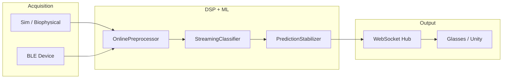

# Systematic Roadmap: OpenAlterEgo

Master plan tying **codebase architecture**, **literature**, and **build order** together.

**Status snapshot:** June 2026 — core Python stack is functional; hardware/firmware and open-vocabulary decoding are not.

---

## 1. What this system is

**OpenAlterEgo** is an open-source, AlterEgo-style **silent speech interface** for a **closed vocabulary of command tokens** (yes/no/left/right/select/cancel). It:

1. Acquires multichannel facial/neck **surface EMG** (real BLE or synthetic sim)
2. Applies causal **DSP** (bandpass, notch, normalization)
3. Runs a **1D CNN** on sliding windows
4. Stabilizes predictions (confidence, SNR gating, debounce)
5. Streams **JSON tokens** over WebSocket to XR/glasses clients



---

## 2. Codebase map (packages)

| Package | Path | Responsibility |
|---------|------|----------------|
| `core` | `openalterego/core/` | `FrameChunk`, `TokenEvent`, `RingBuffer` |
| `acquisition` | `openalterego/acquisition/` | BLE client, OA v1 packets, virtual link |
| `dsp` | `openalterego/dsp/` | Filters, online preprocess, SNR/motion quality |
| `ml` | `openalterego/ml/` | CNN model, train, infer, data splits |
| `runtime` | `openalterego/runtime/` | Streaming decode + stabilization |
| `api` | `openalterego/api/` | WebSocket server + protocol |
| `users` | `openalterego/users/` | Profiles, calibration, collection sessions |
| `sim` | `openalterego/sim/` | Heuristic + biophysical EMG sim, phonology |
| `hardware` | `openalterego/hardware/` | `.oae.json` DSL, presets, validate, resolve, bind |
| `cli` | `openalterego/cli.py` | User-facing commands |

**Tests:** 20+ files under `software/python/tests/` (160+ tests) covering DSP, sim, biophysical perf, users, calibration, streaming, server, integration, hardware DSL.

---

## 3. What is done (MVP vertical slice)

| Layer | Status | Evidence |
|-------|--------|----------|
| Preprocessing modes (standard / wide / clinical) | ✅ | `dsp/filters.py`, `tests/test_filters.py` |
| Motion / SNR quality | ✅ | `dsp/quality.py`, `tests/test_quality.py` |
| User profiles + manager | ✅ | `users/profile.py`, `tests/test_users.py` |
| Calibration workflow | ✅ | `users/calibration.py`, `tests/test_calibration.py` |
| Data collection (sim + BLE duration) | ✅ | `users/collect.py`, `tests/test_collect.py` |
| User-aware train / serve | ✅ | `ml/train.py`, `api/server.py`, `tests/test_integration.py` |
| Adaptive threshold + SNR gate | ✅ | `runtime/streaming.py`, `tests/test_streaming.py` |
| WebSocket API | ✅ | `api/server.py`, `tests/test_server_ws.py` |
| Literature-aligned simulation | ✅ | `sim/literature.py`, `sim/biophysical/` |
| CLI | ✅ | `user`, `calibrate`, `collect`, `train`, `serve`, `sim-dataset`, `hw` |
| Hardware DSL (`.oae.json`) | ✅ | `hardware/`, `tests/test_hardware_dsl.py`, `tests/test_hw_pipeline.py` |

**End-to-end workflow (hardware-bound):**

```bash
openalterego hw run v0_openbci --out ./session --user-id alice --seconds 60
openalterego calibrate --user-id alice --data ./session --fs 250
openalterego train --user-id alice --data ./session
openalterego serve --source sim --user-id alice --hw-spec v0_openbci
```

**Legacy sim workflow:**

```bash
openalterego sim-dataset --out ./session --minutes 2
openalterego user create --user-id alice
openalterego calibrate --user-id alice --data ./session --fs 250
openalterego train --user-id alice --data ./session
openalterego serve --source sim --user-id alice
```

---

## 4. Systematic build phases (what remains)

### Phase A — Simulation realism (no hardware yet)

**Goal:** Close sim→real gap pragmatically until devices arrive.

| # | Task | Status | Module |
|---|------|--------|--------|
| A0 | Realism ladder (`off`→`wearable`→`tang`→`field`) + biophysical default | ✅ | `sim/realism.py` |
| A0b | Tang SNR auto-calibration (`--snr-target-db`) | ✅ | `sim/snr_calibration.py` |
| A0c | Montage-aware forward pickup | ✅ | `sim/montage_geometry.py` |
| A0d | Correlated motion + contact events | ✅ | `sensor_pipeline.py` |
| A1 | A/B **standard vs wide** on same real session | ✅ `dataset ab-preprocess` (Gaddy) | Tang 2025 |
| A2 | **Latency benchmark** (p50/p95 end-to-end) | ✅ `runtime/latency_benchmark.py`, `latency-bench` CLI | Tang 2025, AlterEgo HCI |
| A3 | **BLE collection UX** — `events.csv` labeling workflow | ✅ `collect label-events`, USER_GUIDE | All calibration papers |
| A4 | Publish short **results note** with accuracy + SNR | ✅ `docs/15-gaddy-validation-results.md`, [`docs/gowda/validation/`](gowda/validation/00-README.md) | Gowda 2025 paper + OSF benchmarks |
| A5 | Download + spot-check **Gowda OSF** / Gaddy data compatibility | ✅ Gaddy + Gowda pipelines, results notes | Datasets table in `12-references.md` |

### Phase B — Hardware path

**Goal:** Replace sim with real acquisition.

**Hardware docs:** [`hardware/README.md`](../hardware/README.md) — systematic AFE, electrodes, BLE, BOM, safety.

| # | Task | Owner module | Notes |
|---|------|--------------|-------|
| B0 | Hardware DSL + `--hw-spec` pipeline binding | ✅ `hardware/`, `cli.py`, `api/server.py` | `hardware/08-hardware-dsl.md` |
| B1 | V0 benchtop bring-up (OpenBCI / ADS1299) | `hardware/`, `acquisition/ble_client.py` | `hardware/BOM.md` |
| B2 | Firmware: OA v1 packet stream @ 250 Hz | firmware (external) | `acquisition/packet.py` |
| B3 | Electrode placement guide + photos | `docs/` | Deng 2023, MDPI 2025 |
| B4 | Impedance / contact quality (if hardware supports) | `dsp/quality.py` | Tattoo paper long-wear |

### Phase C — Robustness & UX

**Goal:** Real-world wearable reliability.

| # | Task | Owner module | Literature driver |
|---|------|--------------|-------------------|
| C1 | Optional **motion gating** in preprocess path | ✅ `dsp/online.py`, `serve --motion-gate` | Tang 2025 (33% SNR drop) |
| C2 | **Per-channel SNR** + weak-channel warnings in serve | ✅ `serve --channel-quality-meta --weak-channel-warn` | SE-ResNet motivation |
| C3 | **Re-calibration detector** (SNR vs baseline) | ✅ `users/recalibration.py`, `user check-quality`, serve monitor | SilentWear multi-day drift |
| C4 | Window size sweep (600 vs 1500 ms) | ✅ `window-sweep` CLI | Lai 2023, Tang 2025 |
| C5 | Richer CLI progress for calibrate/train | ✅ `fit_epochs`, tqdm, `--quiet` | UX |

### Phase D — Model upgrades (research)

**Goal:** Close accuracy gap with 2023–25 literature.

| # | Task | Owner module | Literature driver |
|---|------|--------------|-------------------|
| D1 | **SE-ResNet** or channel-attention blocks | ✅ `OpenAlterEgoSEResNet`, `--arch se_resnet` | Tang 2025 |
| D2 | **Knowledge distillation** from ensemble | `ml/train.py` | Lai 2023 |
| D3 | **SpeechNet-scale** tiny model for edge | `ml/model.py` | Meier 2025 |
| D4 | Channel importance visualization | new `ml/analysis.py` | Gowda 2024 Fig. 17 |
| D5 | External benchmark eval (Gaddy WER, Gowda top-5) | `ml/eval/` | Open vocab metrics |
| D6 | **Training throughput** (preprocess + segment cache, AMP, workers, compile) | ✅ `segment_cache.py`, `training_perf.py` | [`18-training-scalability.md`](18-training-scalability.md) |

### Phase E — Vocabulary expansion (long-term)

**Goal:** Move from 6 commands → words / sentences. **Master design:** [`19-open-vocab-and-sim2real.md`](19-open-vocab-and-sim2real.md)

| # | Task | Status | Module |
|---|------|--------|--------|
| E0 | Gowda closed-vocab SPD+CTC (~7% WER) | ✅ | `ml/eval/gowda_phase5–6` |
| E1 | Gowda-shaped biophysical sim + transfer harness | ✅ | `sim/scenarios/`, `ml/eval/sim_transfer.py` |
| E2 | Offline utterance decode (`decode-utterance`) | ✅ | `ml/ctc/infer.py`, `decode_utterance.py` |
| E3 | Streaming CTC in `serve` | ❌ | `runtime/ctc_streaming.py` |
| E4 | Personal LM + correction loop | ❌ | `ml/ctc/personal_lm.py`, `users/corrections.py` |
| E5 | Gowda large-vocab import + sentence CTC | ❌ | `dataset import-gowda-lv` |
| E6 | KenLM / HLG-lite decode | ❌ | `ml/ctc/decode_stack.py` |
| E7 | Cross-modal pretrain (Gaddy vocalized) | ❌ | research |

---

## 5. Priority order (recommended)

```
A (validate on real data)  →  B (hardware)  →  C (robustness)
                                    ↓
              D (model upgrades) in parallel once real data exists
                                    ↓
                        E (open vocab) after closed-vocab accuracy ≥85%
```

**Do not skip Phase A.** Literature consensus (20–450 Hz, motion SNR, personalization) is already encoded in software; what is missing is **measured proof on human EMG**.

---

## 6. Documentation hygiene

| Doc | Action |
|-----|--------|
| `12-references.md` | ✅ Reorganized bibliography (June 2026) |
| `14-systematic-roadmap.md` | ✅ This file |
| `10-implementation-progress.md` | Update to reflect Phases 3–6 complete |
| `08-action-items.md` | Mark completed items; keep only open actions |
| `00-README-IMPLEMENTATION.md` | Point to `14-systematic-roadmap.md` |
| `TODO.md` | Trim duplicate research paragraphs |

---

## 7. Success metrics (from literature)

| Metric | Target | Source |
|--------|--------|--------|
| Per-user command accuracy | ≥ **85%** | Lai 2023, Wang 2021 |
| Static SNR | ≥ **18 dB** | Tang 2025 |
| Motion SNR floor | ≥ **12 dB** (warn below) | Tang 2025 |
| End-to-end latency | **< 500 ms** | HCI / wearable papers |
| Calibration samples | **50–200** per token | Internal + Tattoo paper |
| Cross-session drift | Re-calibrate when SNR drops **> 3 dB** vs baseline | SilentWear 2025 |

---

## 8. Quick links

- Bibliography: [`12-references.md`](12-references.md)
- User workflow: [`USER_GUIDE.md`](USER_GUIDE.md)
- Open backlog: [`TODO.md`](TODO.md)
- Critical literature fixes: [`11-priority-changes.md`](11-priority-changes.md)
- Python package: [`software/python/README.md`](../software/python/README.md)
