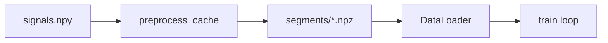

# Training scalability and throughput

How OpenAlterEgo training avoids redundant work on large sessions (Gowda, Gaddy) and how to tune GPU/CPU throughput.

**Modules:** `openalterego/ml/train.py`, `dsp/preprocess_cache.py`, `ml/segment_cache.py`, `ml/training_perf.py`, `ml/device.py`

---

## 1. Two-level disk cache

Training on wide-band, high-rate EMG repeats the same expensive steps every epoch unless cached.

| Layer | Path | What is stored | When it runs |
|-------|------|----------------|--------------|
| **Preprocess** | `sessions/<name>/preprocess_cache/` | Full `(time, channels)` after streaming/offline DSP | Once per session + preprocess/emg/fs combo |
| **Segments** | `sessions/<name>/segments/` | Stacked `(N, C, T)` float32 windows + int64 labels | Once per split (train/val), segment length, seed, channel subset |

**Pipeline order:**



On a second run with the same flags, both layers are **cache hits** — epoch time is dominated by forward/backward, not DSP.

Invalidate automatically when:

- Raw `signals.npy` changes (preprocess meta tracks file hash/size/mtime)
- `events.csv` rows change (segment cache fingerprints event columns)
- Preprocess mode, emg mode, fs, segment_ms, seed, split tag, or channel list change

Force rebuild:

```bash
openalterego train --data ./sessions/gowda_top30 --rebuild-preprocess-cache
openalterego train --data ./sessions/gowda_top30 --rebuild-segment-cache
```

Skip segment cache (debug only):

```bash
openalterego train --data ./sess --no-segment-cache
```

Pre-build caches without training:

```bash
openalterego dataset cache-preprocess --data ./sessions/gowda_top30 --fs 5000 --emg-mode wide
```

---

## 2. DataLoader and memory

| Flag | Default | Effect |
|------|---------|--------|
| `--num-workers` | `-1` (auto) | Worker processes for batch prefetch; auto = **0 on Windows**, else `min(8, cpu_count-1)` |
| `--mmap-signals` | off | `np.load(..., mmap_mode="r")` — lower RAM on multi-GB `signals.npy` |
| `--grad-accum-steps` | `1` | Effective batch = `batch_size × steps`; useful when GPU memory is tight |

Auto settings when CUDA is available:

- `pin_memory=True`
- `persistent_workers=True` and `prefetch_factor=2` when `num_workers > 0`
- `non_blocking=True` host→device copies

---

## 3. GPU throughput

| Flag / knob | Notes |
|-------------|--------|
| `--device cuda` / `auto` | Uses CUDA build from `software/python/pyproject.toml` (cu124) |
| `--amp` | Mixed precision on CUDA; **on by default** when `device=cuda` (use `--no-amp` to disable) |
| `--compile` | Optional `torch.compile(model)`; first epoch slower (compile), later epochs faster |
| TF32 | Enabled in `configure_cuda_for_training()` on Ampere+ (matmul + cuDNN) |
| `cudnn.benchmark` | Enabled on CUDA for fixed input shapes (segment CNN) |

**Recommended Gowda top-30 command** (after import):

```bash
openalterego train --data ./sessions/gowda_top30 --fs 5000 --emg-mode wide \
  --preprocess-mode streaming --segment-ms 900 --split-by auto \
  --device cuda --batch-size 32 --num-workers 4
```

AMP is enabled automatically on CUDA (`--no-amp` to disable).

**Benchmark bottlenecks:**

```bash
openalterego train-benchmark --data ./sessions/gowda_top30 --fs 5000 --emg-mode wide \
  --preprocess-mode streaming --segment-ms 900 --compare
```

---

## 4. Scaling dimensions

| Dimension | Approach |
|-----------|----------|
| **Larger vocabulary / more events** | Segment cache amortizes windowing; increase `--batch-size` or `--grad-accum-steps` |
| **More channels (31 Gowda)** | Preprocess cache is full-width; use `--channels` only when experimenting (separate segment cache per subset) |
| **Ensemble teachers** | Each teacher uses `seed+i` → separate segment caches; share preprocess cache |
| **Multi-session** | One session folder per subject; no cross-session cache yet |
| **Future** | Mixed-precision inference export, WebDataset/sharded NPZ for cloud training |

---

## 5. What does *not* speed up accuracy

Caches and GPU flags improve **wall-clock**, not label quality. For Gowda word classification, the dominant accuracy fixes were:

1. Correct event alignment vs `signals.npy` (import pipeline)
2. Official word boundaries and per-trial z-score
3. Appropriate split (`--split-by gowda` for paper-style 370/30 sentences)

See [`docs/gowda/validation/02-top30-corrected.md`](gowda/validation/02-top30-corrected.md).

---

## 6. Quick benchmark (local)

```bash
# Phase breakdown + cold vs warm cache
openalterego train-benchmark --data ./sessions/gowda_top30 --fs 5000 --emg-mode wide \
  --preprocess-mode streaming --segment-ms 900

# Sweep workers (and AMP on/off on CUDA)
openalterego train-benchmark --data ./sessions/gowda_top30 --fs 5000 --emg-mode wide \
  --preprocess-mode streaming --segment-ms 900 --compare
```

Writes `train_benchmark.json` or `train_benchmark_compare.json` under the session folder.

Log lines to watch during normal training: `[openalterego] preprocess: cache hit`, `wrote segment cache`, and per-epoch tqdm speed.

---

## 7. Empirical results (June 2026)

Environment for these runs: **Windows, CPU-only PyTorch** (`cuda False`). CUDA + default AMP will shift the bottleneck further toward compute/GPU saturation; numbers below establish **cache value** and **worker policy**.

### Sim session (`bench_sim`, 121 train / 31 val, 8 ch @ 250 Hz)

| Scenario | Epoch time | Bottleneck |
|----------|------------|------------|
| `workers=0` | **2.2 s** | compute (96%) |
| `workers=2` | 66.3 s | dataloader (spawn IPC) |
| `workers=8` | 246.4 s | dataloader |

**Takeaway:** On Windows, `DataLoader` workers **hurt** small sessions. Auto workers now default to **0 on Windows** (`training_perf.default_num_workers`).

### Gowda top-30 (`gowda_top30`, 989 train / 234 val, 31 ch @ 5 kHz, 900 ms windows)

| Phase | Cold run | Warm run (caches hit) |
|-------|----------|------------------------|
| preprocess | 1.1 s (hit) | 1.3 s (hit) |
| segment build | **25.9 + 6.7 s** | **2.7 + 0.6 s** (hit) |
| dataloader init | 3.6 s | 3.3 s |
| **1 epoch train+val** | **174.6 s** | **144.8 s** |

Epoch breakdown (warm): **94% compute**, 5% validation, &lt;1% dataloader wait.

**Bottleneck on CPU:** forward/backward on SE-ResNet over `(32, 31, 4500)` tensors. **Mitigations:** CUDA + default AMP, larger `--batch-size` if VRAM allows, optional `--compile`.

**One-time setup:** segment cache saves ~29 s per run after first build; preprocess cache already amortizes the 5 kHz × 31 ch DSP pass.

Raw JSON: `sessions/bench_sim/train_benchmark_compare.json`, `sessions/gowda_top30/train_benchmark.json`.

---

## 8. Related docs

- Roadmap Phase D: [`14-systematic-roadmap.md`](14-systematic-roadmap.md)
- Gowda import: [`gowda/openalterego/02-import-pipeline.md`](gowda/openalterego/02-import-pipeline.md)
- User commands: [`USER_GUIDE.md`](USER_GUIDE.md)
