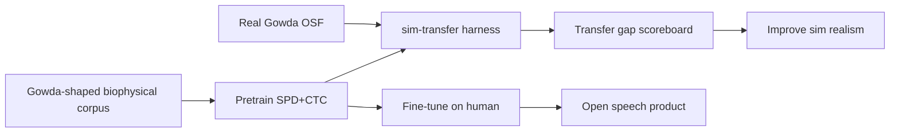

# Open Vocabulary, Sim2Real, and Acclimation — Master Design

**Status:** June 2026 — Phase 5–6 closed-vocab CTC validated on real Gowda EMG (~7% WER). This document is the implementation north star for open-ended silent speech, biophysical corpus generation, and measurable sim→real transfer.

**Related:** [`14-systematic-roadmap.md`](14-systematic-roadmap.md) · [`gowda/openalterego/01-gap-analysis.md`](gowda/openalterego/01-gap-analysis.md) · [`gowda/validation/08-phase6-trial-lm.md`](gowda/validation/08-phase6-trial-lm.md) · [`05-simulation.md`](05-simulation.md)

---

## Pass 1 — North star

**Goal:** Free-form silent dictation that **improves per user**, without discarding the command-mode stack.

**Honest scope:** Open vocabulary does not mean “no language model.” It means decode composes **phonemes → words** via lexicon + LM. Gowda large-vocab (~74% WER EMG-only) is the published ceiling; personal 1–5k word LM at ~15–25% WER on prompted sentences is the first product target.

**Dual-mode runtime:** Keep `StreamingClassifier` for commands; add `StreamingCTCDecoder` for open speech. Same acquisition, DSP, and quality layers; different head and protocol messages.

**Per-user geometry is non-optional:** Gowda’s change-of-basis means each user needs their own `SPDBasis` (Fréchet mean eigenbasis `Q`), not only a fine-tuned GRU.

---

## Pass 2 — What exists today

### Command path (production)

| Component | Module | Notes |
|-----------|--------|-------|
| Sliding-window CNN | `ml/model.py`, `ml/infer.py` | ~6 tokens, softmax |
| Stream decode | `runtime/streaming.py` | Debounce, SNR gate |
| Serve | `api/server.py` | WebSocket `token` messages |
| User profile | `users/profile.py` | CNN thresholds, window/stride |

### Research path (Gowda closed lexicon)

| Component | Module | Notes |
|-----------|--------|-------|
| SPD σ(τ) features | `ml/spd/features.py` | `diag_delta` 62-d default |
| BiGRU + CTC | `ml/ctc/model.py`, `train.py` | Phase 5 v3 |
| Decode | `ml/ctc/decode.py`, `lexicon_viterbi.py` | Beam, Viterbi |
| Trial context | `ml/ctc/trial_lm.py`, `trial_decode.py` | Slot priors, 6.8% test WER |
| Real data import | `ml/datasets/gowda.py` | 124 labels, 31 ch @ 5 kHz |
| Eval phases | `ml/eval/gowda_phase3–6.py` | Reproducible CLI |

### Simulation

| Engine | Fidelity | Dataset use |
|--------|----------|-------------|
| `heuristic` | Band-limited spatial tokens | CI, plumbing |
| **`biophysical`** (default) | MUAP pool + forward pickup + Tang SNR | Pretrain, ablations |
| `--drive-mode phoneme` | Phone-level motor drive + `phonemes.csv` | CTC architecture tests |
| **`--phone-templates`** (M1) | Real-fit per-phone channel/rate/duration templates | Sim2real phoneme geometry |

**Gap:** Sim is 8 ch @ 250 Hz command vocab; Gowda benchmark is 31 ch @ 5 kHz × 124-word trials. **Sim→real transfer harness exists** (`analyze sim-transfer`); **phoneme template M1** in [`gowda/validation/11-phoneme-synth-m1.md`](gowda/validation/11-phoneme-synth-m1.md).

---

## Pass 3 — Paradigm shift

```mermaid
flowchart TB
  subgraph today [Today: closed commands]
    EMG1[EMG stream] --> WIN[600ms window]
    WIN --> CNN[1D CNN softmax]
    CNN --> DEB[debounce]
    DEB --> TOK[yes / no / left / ...]
  end

  subgraph open [Open speech]
    EMG2[EMG stream] --> SEG[utterance segment]
    SEG --> SPD[SPD sigma features]
    SPD --> CTC[BiGRU + CTC phonemes]
    CTC --> DEC[beam + lexicon / LM]
    DEC --> TXT[words / sentences]
    TXT --> CORR[user corrections]
    CORR --> ADAPT[personal LM + adapter]
    ADAPT --> CTC
  end
```



**Phonemes are the open-vocabulary interface.** Words come from decode, not softmax class count. `PHONEME_ALPHABET`, CMUdict, and CTC forward scoring in `lexicon_viterbi.py` are already in place.

---

## Pass 4 — Sim2real bridge (critical path)

Open corpus and sim2real share one pipeline:



### Tiered honesty for synthetic EMG

| Tier | Claim | Requirement |
|------|-------|-------------|
| T1 Pipeline | Sim sessions train/eval in same code as OSF | ✅ `sim-dataset` → `train_gowda_ctc` |
| T2 Closed CNN on sim | High sim accuracy | Expected; not transfer proof |
| T3 CTC on sim phonemes | Architecture validation | Gowda-shaped scenario + phoneme drive |
| T4 Replace human data | Production without fine-tune | **Requires transfer harness + statistical matching** |

### Gowda-aligned sim (PR1)

Sessions must match real layout:

| Field | Gowda OSF | Sim target |
|-------|-----------|------------|
| `signals.npy` | `(T, 31)` float32 | Same |
| `fs_hz` | 5000 | 5000 |
| `events.csv` | `start/end`, `label`, `trial_id`, `word_idx` | Same |
| Trial structure | 4 words: weekday → month → ordinal → year | Scripted schedule |
| Drive | Real articulation | `--drive-mode phoneme` + Gowda lexicon |
| Hardware preset | Lab array | `gowda_31ch_5khz` |

### Transfer harness (PR1)

```bash
uv run openalterego analyze sim-transfer \
  --sim ./corpus/gowda_sim_train \
  --real ./sessions/gowda_sv_full \
  --device cuda
```

Reports:

- **Zero-shot:** train sim-only → test real (official 100-sentence split)
- **Fine-tune curve:** 0% / 10% / 50% / 100% of real train trials
- PER, WER, word accuracy; decode `trial_lm` on real test

This scoreboard drives realism work (ISI/PSD matching, coarticulation, montage).

### Statistical matching (future)

From `hardware/10-neurobiophysical-emg.md` — not yet implemented:

- Fit ISI, PSD, cross-channel correlation to Gowda/Gaddy subsets
- Coarticulation at phone boundaries (overlap vs hard partition)
- Population variance across seeds and anatomy draws

---

## Pass 5 — Open vocabulary decode stack

Layers (reuse existing code):

| Layer | Module | Status |
|-------|--------|--------|
| L0 Phoneme posterior | CTC BiGRU | ✅ |
| L1 Beam / greedy | `decode.py` | ✅ |
| L2 Lexicon Viterbi | `lexicon_viterbi.py` | ✅ closed 124 words |
| L3 Trial / slot LM | `trial_lm.py`, `trial_decode.py` | ✅ Gowda 4-word |
| L4 Personal n-gram | `personal_lm.py` (planned) | ❌ |
| L5 Open lexicon HLG-lite | CMUdict + KenLM shallow fusion | ❌ |
| L6 LLM rerank | MONA-style | ❌ research |

### Milestone vocabulary stages

| Stage | Lexicon | LM | Expected WER (human EMG) |
|-------|---------|-----|--------------------------|
| E0 | Gowda 124-word | trial_lm slots | **~7%** (achieved) |
| E1 | Personal 5k | personal n-gram | ~15–25% prompted |
| E2 | CMUdict pruned | personal + 4-gram | ~30–50% |
| E3 | + cross-modal pretrain | + LLM rerank | ~12–20% aspirational |

### Sentence-level CTC

Today `PhonemeCTCDataset` is **per-word**. Open speech needs `SentenceCTCDataset` (trial = one item, concatenated phoneme targets). Train on Gowda large-vocab after OSF import.

---

## Pass 6 — Acclimation (four loops)

| Loop | Latency | Adapts | Module |
|------|---------|--------|--------|
| Cold | Instant | Word priors from user text | `PersonalLM` |
| Warm | Minutes | LM weight, beam, SNR gate | `tune_lm_weight` |
| Onboarding | ~10 min | Per-user `SPDBasis` + adapter | `users/onboarding.py` |
| Hot | Continuous | Corrections → LM + adapter | `users/corrections.py` |

### `DecodeProfile` (planned extension to `UserProfile`)

```python
@dataclass(frozen=True)
class DecodeProfile:
    mode: Literal["commands", "open_speech", "hybrid"] = "commands"
    ctc_checkpoint: Optional[Path] = None
    spd_basis_path: Optional[Path] = None
    personal_lm_path: Optional[Path] = None
    adapter_checkpoint: Optional[Path] = None
    decode_mode: str = "trial_lm"
    beam_width: int = 50
    lm_weight: float = 1.0
    lexicon_mode: Literal["closed", "personal", "open"] = "personal"
    segmentation: Literal["push_to_talk", "vad"] = "push_to_talk"
    correction_count: int = 0
    adapter_train_threshold: int = 20
```

### Per-user directory

```
users/alice/
  profile.json
  model.pt                 # command CNN
  ctc/base.pt
  ctc/adapter.pt
  ctc/spd_basis.npz
  lm/personal.arpa
  corrections/log.jsonl
```

### Correction event schema

```python
@dataclass
class CorrectionEvent:
    id: str
    t: float
    session_id: str
    utterance_id: str
    emg_start_sample: int
    emg_end_sample: int
    predicted_text: str
    corrected_text: str
    decode_meta: dict
    confirmed: bool = True
```

Implicit positives: user sends message without edit → `corrected_text == predicted_text`.

---

## Pass 7 — Runtime and protocol

### Segmentation (ship order)

1. **Push-to-talk** — `ptt_start` / `ptt_end` control messages; 150 ms pad
2. **EMG envelope VAD** — RMS on rectified EMG, hang 400 ms
3. **CTC blank runs** — research only

### `StreamingCTCDecoder` (planned)

```
EMG chunks → OnlinePreprocessor → OnlineSPDStream (50 ms hop)
  → CTC BiGRU (streaming states)
  → DecodeStack (beam + LM)
  → partial_transcript / final_transcript WebSocket
```

### Protocol v2 (non-breaking)

Server → client: `partial_transcript`, `final_transcript` (alongside existing `token`).

Client → server: `control` with `ptt_start`, `ptt_end`, `correct`, `set_decode_mode`.

### Offline vertical slice (PR2)

Before WebSocket:

```bash
uv run openalterego decode-utterance \
  --session ./sessions/gowda_sv_full \
  --trial-id 371 \
  --checkpoint ./sessions/gowda_sv_full/ablations/ctc_spd_v3_diag_delta_seed1337.pt
```

Uses `ml/ctc/infer.py`, `ml/spd/online.py`, `trial_decode`.

---

## Pass 8 — Training curriculum

| Stage | Data | Model | Goal |
|-------|------|-------|------|
| T0 | Gowda small-vocab real | SPD v3 global | ✅ ~7% WER |
| T0s | Gowda-shaped sim | SPD v3 global | Transfer baseline |
| T1 | Gowda large-vocab | Sentence CTC | ~50–75% WER paper band |
| T2 | User onboarding | Adapter | −5–15% relative |
| T3 | User corrections | Adapter refresh | Continuous |
| T4 | Gaddy vocalized (optional) | Encoder pretrain | Cross-modal |

**Recipe:**

```
1. Pretrain on biophysical Gowda-shaped corpus (many seeds)
2. Measure transfer on real Gowda (sim-transfer harness)
3. Fine-tune on OSF small-vocab (anchor)
4. Per-user adapter on BLE sessions + corrections
```

---

## Pass 9 — Implementation milestones

### M0 — Foundation ✅ (PR2)

| Task | Module |
|------|--------|
| `load_ctc_model` | `ml/ctc/infer.py` |
| `OnlineSPDStream` | `ml/spd/online.py` |
| `decode-utterance` CLI | `cli.py` |
| Tests | `test_ctc_infer.py`, `test_spd_online.py` |

### M1 — Gowda sim + transfer ✅ (PR1)

| Task | Module |
|------|--------|
| `gowda_31ch_5khz` preset | `hardware/presets.py`, `montages.py` |
| Scripted 4-word trials | `sim/scenarios/gowda_small_vocab.py` |
| `sim-dataset --scenario gowda_sv` | `cli.py` |
| `sim-transfer` harness | `ml/eval/sim_transfer.py` |

### M2 — Live serve ✅

| Task | Module |
|------|--------|
| `StreamingCTCDecoder` | `runtime/ctc_streaming.py` |
| Protocol messages | `api/protocol.py` |
| `serve --decode-mode open_speech` | `api/server.py` |

### M3 — Onboarding + basis (in progress)

| Task | Module |
|------|--------|
| `onboard` CLI | `users/onboarding.py` |
| Per-user `SPDBasis` | `ml/spd/basis_store.py` |
| Adapter fine-tune | `users/adapter_train.py` |

### M4 — Correction loop

| Task | Module |
|------|--------|
| `CorrectionStore` | `users/corrections.py` |
| LM hot-update | `ml/ctc/personal_lm.py` |
| Background adapter | trigger at N corrections |

### M5 — Open vocab scale

| Task | Module |
|------|--------|
| Large-vocab import | `dataset import-gowda-lv` |
| `SentenceCTCDataset` | `ml/ctc/sentence_dataset.py` |
| KenLM shallow fusion | `ml/ctc/decode_stack.py` |

---

## Pass 10 — Risks, metrics, UX contract

### Risks

| Risk | Mitigation |
|------|------------|
| 31-ch model vs 8-ch wearable | Channel-subset adapter; montage sim |
| Lexicon Viterbi O(n) | Prune to personal top-5k |
| Catastrophic forgetting | EMA merge; freeze lower GRU layers |
| No utterance boundaries | PTT first |
| Bad decode → distrust | Top-3 alternatives; abstain on high PER proxy |
| Privacy | Local-only LM and corrections |

### Success metrics

| Metric | Target | Context |
|--------|--------|---------|
| Gowda closed test WER | ≤ **10%** | ✅ ~7% with trial_lm |
| Sim→real zero-shot WER | Measure & improve | PR1 harness |
| Personal dictation WER | ≤ **25%** | 5k word LM, prompted |
| End-to-end latency | < **500 ms** | PTT finalize path |
| Onboarding time | ≤ **10 min** | 50 prompted sentences |

### UX contract

| Day | Experience | System |
|-----|------------|--------|
| 0 | Optional text corpus paste | PersonalLM only |
| 1 | 10 min silent prompted reading | User basis + adapter v1 |
| 2–7 | Dictate, tap to fix | LM instant; adapter every ~20 fixes |
| 30+ | New jargon after 2–3 corrections | Corrections absorbed |

---

## Commands (quick reference)

```bash
# Gowda-shaped biophysical corpus (PR1)
uv run openalterego sim-dataset --out ./corpus/gowda_sim \
  --scenario gowda_sv --trials 370 --hw-spec gowda_31ch_5khz \
  --sim-engine biophysical --realism tang --snr-target-db 18.9 \
  --drive-mode phoneme

# Sim→real transfer eval (PR1)
uv run openalterego analyze sim-transfer \
  --sim ./corpus/gowda_sim --real ./sessions/gowda_sv_full --device cuda

# Offline utterance decode (PR2)
uv run openalterego decode-utterance \
  --session ./sessions/gowda_sv_full --trial-id 371 \
  --checkpoint ./sessions/gowda_sv_full/ablations/ctc_spd_v3_diag_delta_seed1337.pt

# Closed-vocab research baseline (existing)
uv run openalterego analyze gowda-phase6 --data ./sessions/gowda_sv_full --device cuda
```

---

## Package layout (target)

```
openalterego/
  runtime/
    streaming.py              # existing StreamingClassifier
    ctc_streaming.py            # planned StreamingCTCDecoder
  ml/
    ctc/
      infer.py                  # PR2
      decode_stack.py           # planned
      personal_lm.py            # planned
      sentence_dataset.py       # planned
    spd/
      online.py                 # PR2
      basis_store.py            # planned
    eval/
      sim_transfer.py           # PR1
  sim/
    scenarios/
      gowda_small_vocab.py      # PR1
  users/
    corrections.py              # planned
    onboarding.py               # planned
    adapter_train.py            # planned
```

---

*This document is maintained as the single source of truth for open-vocab and sim2real work. Update milestone checkboxes as PRs land.*
