# SPD Feature Pipeline (Paper Method)

End-to-end flow from [arXiv:2502.05762v2](https://arxiv.org/html/2502.05762v2) §3 and Appendix A.

```mermaid
flowchart LR
  EMG[Multichannel EMG fv t] --> BP[80-1000 Hz + z-norm]
  BP --> WIN[Sliding window tau]
  WIN --> E[Edge matrix E tau]
  E --> SPD[SPD regularize eta=0.1]
  SPD --> FREC[Fréchet mean F on train]
  FREC --> Q[Fixed eigenbasis Q]
  Q --> SIG[sigma tau = Q^T E Q]
  SIG --> GRU[GRU layers]
  GRU --> CTC[CTC phoneme logits]
  CTC --> BEAM[Beam search]
  BEAM --> PHN[Phoneme sequence]
  PHN --> HLG[HLG decoder optional]
  HLG --> TXT[Word text]
```

---

## Step 1 — Edge matrix ℰ(τ)

Over window τ = [tstart, tend]:

- eij = fiT fj (covariance across time in window)
- Symmetric positive **semi**-definite

## Step 2 — SPD regularization

ℰ ← (1 − η)ℰ + η·trace(ℰ)·**I**, with **η = 0.1**

## Step 3 — Fréchet mean & fixed basis

- Compute geometric mean ℱ over all training ℰ(τ) (Cholesky-based Fréchet mean, Lin 2019).
- Eigendecompose ℱ = Q Λ QT.
- Use **same Q** for all windows at train and test time.

## Step 4 — Approximate diagonalization

σ(τ) = QT ℰ(τ) Q

- Off-diagonals small → treat as approximate eigenvalues in shared basis.
- Input to GRU: sequence of σ(τ) (flattened or structured 31×31 per step).

## Step 5 — Sequence decoding

- **CTC loss** — no forced alignment between EMG frames and phonemes.
- **40 phoneme labels** (+ blank).
- Beam width **50** for PER.
- Optional **HLG** FST for WER (large-vocab only).

---

## Why not spectrograms?

Paper Table 1: spectrogram-matched GRU **collapses** to few phoneme sequences → WER 100%. σ(τ) encodes **articulatory** structure tied to muscle co-activation.

---

## OpenAlterEgo gap

Current stack uses **1D CNN on bandpassed EMG windows** — no ℰ(τ), no CTC, no phoneme targets. See [../openalterego/01-gap-analysis.md](../openalterego/01-gap-analysis.md).
