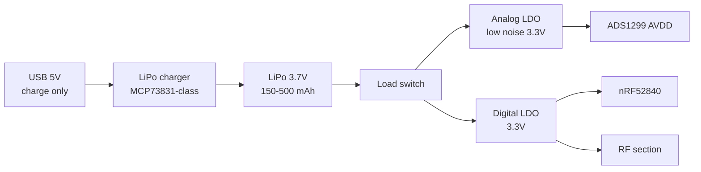

# Power and electrical safety

Power architecture, debug isolation, and safety practices for wearable biopotential acquisition.

> **Scope:** Research / hobby prototype practices. **Not** a substitute for IEC 60601 certification or clinical deployment review.

---

## Power architecture (V1 wearable)

### Design rules

| Rule | Rationale |
|------|-----------|
| **Battery powers device while worn** | No mains earth path to body |
| **Separate analog + digital rails** | ADS1299 noise spec assumes clean AVDD |
| **Star ground at AFE** | Reduce digital hash on analog inputs |
| **Charge while off or in case** | Avoid charging current through body path |
| **Fuse / PTC on battery** | Fault protection |

### Power budget (estimate)

| Block | Current @ 250 Hz 8ch | Notes |
|-------|----------------------|-------|
| ADS1299 | ~5 mA | Datasheet typical |
| nRF52840 TX | ~5–10 mA peak | BLE notify bursts |
| MCU idle | ~1–3 mA | Zephyr power mgmt |
| **Total** | ~15–25 mA avg | SilentWear: **~22 mW** system ([arXiv:2603.02847](https://arxiv.org/abs/2603.02847)) |

**150 mAh cell → ~6–10 h** at 20 mA — adequate for V1; target 500 mAh for all-day experiments.

---

## V0 benchtop power

| Mode | Setup |
|------|-------|
| **Field collection** | Battery-powered AFE only; phone/laptop on battery |
| **Lab debug (tethered)** | **USB isolator** between laptop and AFE (medical-grade preferred) |
| **Avoid** | Laptop on wall power + direct USB to patient-connected front-end |

AlterEgo development used mobile relay ([Kapur 2018](https://dl.acm.org/doi/10.1145/3172944.3172977)) — keeps acquisition off mains ground.

---

## Patient leakage and input protection

Biopotential amplifiers must limit current under single-fault conditions ([IEC 60601-1](https://webstore.iec.ch/) principles).

### Minimum protections

| Element | Typical value | Purpose |
|---------|---------------|---------|
| Series resistor per lead | **100 kΩ – 1 MΩ** | Limit fault current |
| ESD diodes | To supply rails | HBM protection |
| Input clamping | Within ADS1299 abs max | Survive defibrillation-level events (medical grade) |
| Enclosure | Plastic / isolated | No exposed conductive chassis |

**ADS1299** integrates input protection suitable for EEG/ECG class devices when used per TI layout guide.

### Leakage target (research practice)

Design for **< 10 µA** patient leakage under normal operation; verify with bench measurement if targeting clinical path.

---

## Grounding and common-mode

| Scenario | Risk | Mitigation |
|----------|------|------------|
| Laptop charger connected | Mains leakage via USB ground | USB isolator or battery-only laptop |
| Shared ground with bench equipment | Ground loop hum | Single-point ground at AFE |
| Long unshielded leads | 50/60 Hz pickup | Shielded twisted pair; BIAS active |
| Cell phone charging while worn | Similar to laptop | Avoid charging phone in contact with user |

**Kapur 2020:** notch 60 Hz **and harmonics** — indicates mains coupling is expected in real environments; implement in DSP (`dsp/filters.py` harmonic notch).

---

## ESD and handling

- ESD mat / wrist strap during PCB assembly
- Discharge before attaching electrodes to powered device
- Store dry electrodes in antistatic pouch

---

## Regulatory awareness (not certification)

| Standard | Relevance |
|----------|-----------|
| **IEC 60601-1** | Medical electrical equipment safety |
| **IEC 60601-2-26** | EMG / evoked potential (if clinical) |
| **ISO 13485** | QMS for medical devices |
| **FCC / CE** | BLE radio certification for product sale |

**OpenAlterEgo status:** Research platform — follow safety **practices**, not full compliance, unless explicitly pursuing clinical product.

---

## Pre-wear safety checklist

- [ ] Device powered from battery (or isolated USB)
- [ ] No damaged leads or cracked electrodes
- [ ] Series resistors populated on all inputs
- [ ] BIAS/reference electrode connected
- [ ] User has no broken skin under electrodes (gel irritation risk)
- [ ] User can remove device in < 5 s (emergency stop)
- [ ] Data path verified on bench before on-body

---

## Failure modes

| Failure | Detection | Response |
|---------|-----------|----------|
| Lead-off / dry contact | ADS1299 lead-off; high motion index | Pause collection; re-seat electrode |
| ADC saturation | Host clip detector | Reduce PGA gain |
| BLE disconnect | Connection timeout | Buffer on device (future) or alert user |
| Battery low | SOC ADC | Graceful shutdown + notify |
| Overheating charger | Thermistor on cell | MCP73831 thermal foldback |

---

## Related

- Input network: [02-analog-front-end.md](02-analog-front-end.md)
- Cable strain / enclosure: [06-mechanical-wearable.md](06-mechanical-wearable.md)
- Patent safety discussion: US10878818B2
