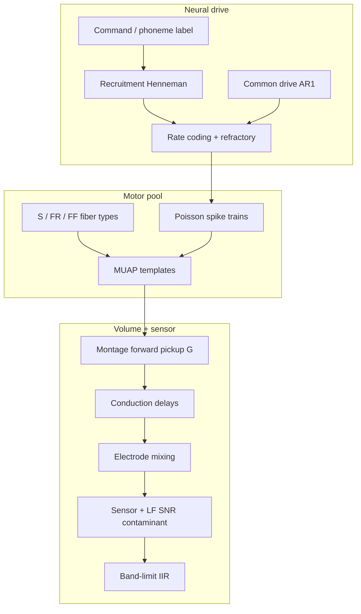

# Neurobiophysical EMG synthesis

Design for **neurobiologically grounded surface EMG from scratch** — accelerated production, fine-grained sim→real matching, no hardware required.

**Implementation:** `software/python/openalterego/sim/biophysical/`  
**Model version:** `openalterego_biophysical_emg_v5`

---

## Vision

Generate multichannel facial/neck sEMG as the **superposition of motor-unit action potentials (MUAPs)** driven by **stochastic spinal motoneuron pools**, propagated through a **pickup forward model**, corrupted by **wearable sensor physics**, and band-limited to literature DSP targets.



---

## What v5 models (today)

| Layer | Module | Physiology |
|-------|--------|------------|
| **Fiber types** | `physiology.py` | S (Type I), FR (IIa), FF (IIx) — pool fractions, max rates, MUAP width |
| **Size principle** | `physiology.py` | Recruitment rank ↔ inverse gain; early S, late FF |
| **Refractory period** | `pool_batch.py` | ~2.5 ms minimum ISI per unit |
| **Recruitment** | `recruitment.py` | Sigmoid gates vs burst activation (rank-based) |
| **Rate coding** | `motor_pool.py` | Label-conditioned Poisson rates, capped by fiber max rate |
| **Common drive** | `stream.py` | Shared AR(1) rate modulation across pool |
| **MUAP synthesis** | `muap.py` | Skewed biphasic ~5–15 ms (Farina/Merletti scale) |
| **Forward pickup** | `forward_model.py`, `montage_geometry.py` | 1D Green's falloff + literature montage sites |
| **Conduction** | `conduction.py` | Per-electrode sample delays |
| **Batch synthesis** | `pool_batch.py` | Vectorized multi-unit superposition per window |
| **Sensor realism** | `sensor_pipeline.py`, `realism.py` | Pink LF, mains, motion, contact, post-BP LF for Tang SNR |
| **SNR calibration** | `snr_calibration.py` | Auto-tune `lf_snr_scale` → 18.9 dB static (Tang 2025) |

### Config flags (`BiophysicalSimStreamConfig`)

| Flag | Default | Meaning |
|------|---------|---------|
| `use_physiological_pool` | `true` | S/FR/FF fiber types + refractory |
| `use_batch_synthesis` | `true` | `pool_batch.superpose_motor_pool_window` |
| `refractory_ms` | `2.5` | Minimum inter-spike interval |
| `n_motor_units` | `48` | Pool size |
| `use_forward_pickup` | `true` | Montage-aware G matrix |
| `use_recruitment` | `true` | Henneman gating |
| `band_limit_output` | `true` | Causal token-band IIR |

---

## What is NOT yet modeled (roadmap)

| Gap | Target approach | Literature |
|-----|-----------------|------------|
| 3D volume conductor | Layered FEM or fast multipole | Lowery, Merletti |
| Intracellular → extracellular | Rosenfalck fiber potentials | Farina 2008 |
| Rate–torque / fatigue | Force–EMG nonlinearity, firing rate decay | De Luca, Fuglevand |
| Corticomotoneuronal drive | Multi-latent common input, beta band | Negro & Farina |
| Innervation zones | Spatial MU territories along fiber | Merletti |
| Articulatory biomechanics | Hill-type orofacial model → drive | Gaddy lineage |
| Electrode impedance dynamics | Time-varying gain from contact quality | Tattoo/wearable papers |
| GPU batch corpus gen | JAX/CuPy scatter-add, parallel shards | — |

---

## Accelerated production

### Current optimizations (v5/v6)

1. **`synth_mode=fast`** — auto backend: **numba > rust > python** (FFT convolve when chunk long enough)
2. **`synth_mode=numba`** — Numba JIT spike scatter (`pool_numba.py`)
3. **`synth_mode=rust`** — Rust/pyO3 scatter (`software/python/accel/`, maturin build)
4. **`MotorPoolSynthCache`** — padded templates + weights amortized across chunks
5. **Vectorized sensor noise** — `lfilter` AR(1)/pink + vectorized mains/motion
6. **Multi-channel `sosfilt`** — single bandpass pass on `(n, c)` buffer
7. **`sim-benchmark --extended`** — sweeps up to 4 kHz, 192 MU, 32 ch

### Backend install

```bash
cd software/python
uv sync --extra accel          # numba
cd accel && maturin develop --release   # rust (requires Rust toolchain)
```

### Scaling laws (empirical)

```
T_chunk ≈ α·n_mu·n·log(n)  [FFT convolve]  +  β·n·c  [sensor + bandpass]
n = fs · chunk_ms / 1000
realtime_factor = chunk_ms / ms_per_chunk    (target ≥ 25× for corpus gen)
```

| Knob | Scaling | Notes |
|------|---------|-------|
| `fs_hz` | ~sub-linear vs naive | MUAP length grows with fs but convolve amortizes |
| `channels` | ~O(c) | Spread + bandpass |
| `n_motor_units` | ~O(n_mu) | One convolve per active unit |
| `chunk_ms` | amortizes Python overhead | Use `--auto-chunk` or `sim-benchmark --tune-chunk` |

### Benchmark commands

```bash
cd software/python
uv run openalterego sim-benchmark                    # standard sweep
uv run openalterego sim-benchmark --extended         # up to 4 kHz / 192 MU
uv run openalterego sim-benchmark --fs 4000 --synth-mode rust
uv run openalterego sim-benchmark --tune-chunk --fs 4000 --target-rt 30
uv run openalterego sim-dataset --out ./corpus --fs 2000 --auto-chunk --sim-engine biophysical ...
```

### Next optimizations

| Technique | Status |
|-----------|--------|
| Numba JIT on spike scatter | **done** (`pool_numba.py`) |
| Rust/pyO3 scatter kernels | **done** (`accel/`) |
| `scipy.signal.lfilter` for AR(1)/pink noise | partial |
| Sparse convolution / template bank | planned |
| Parallel `generate_dataset` shards | planned |
| GPU batch scatter | planned |

### Recommended corpus command

```bash
cd software/python
uv run openalterego sim-dataset --out ./corpus/session_001 \
  --sim-engine biophysical --realism tang --snr-target-db 18.9 \
  --hw-spec v1_wearable_ble --minutes 10
```

`meta.json` records `sim_biophysical_model`, `use_physiological_pool`, `snr_calibration`, `quality_metrics`.

---

## Fine-grained reality matching

Escalation path:

1. **Preset ladder** — `off` → `wearable` → `tang` → `field` ([09-simulation-realism.md](09-simulation-realism.md))
2. **SNR targets** — static 18.9 dB; motion 12.7 dB (future: motion-conditioned calibration)
3. **Hardware DSL** — montage, fs, preprocess mode bound to sim ([08-hardware-dsl.md](08-hardware-dsl.md))
4. **Statistical matching** (future) — fit ISI, PSD, cross-channel correlation to Gowda/Gaddy subsets

---

## Module map

| File | Role |
|------|------|
| `physiology.py` | Fiber types, pool init, rate caps |
| `pool_batch.py` | Vectorized MUAP superposition |
| `motor_injection.py` | Window-level pool driver |
| `motor_pool.py` | Label → rate allocation |
| `recruitment.py` | Henneman sigmoid gates |
| `muap.py` | Analytic MUAP templates |
| `forward_model.py` | 1D pickup matrix |
| `montage_geometry.py` | Literature electrode positions |
| `stream.py` | Chunk orchestration |
| `snr_calibration.py` | Tang SNR auto-tune |

**Tests:** `tests/test_neurobiophysical.py`, `tests/test_biophysical.py`, `tests/test_sim_realism_ladder.py`

---

## Related

- [09-simulation-realism.md](09-simulation-realism.md) — preset ladder + CLI
- [08-hardware-dsl.md](08-hardware-dsl.md) — `.oae.json` binding
- `docs/12-references.md` — bibliography
