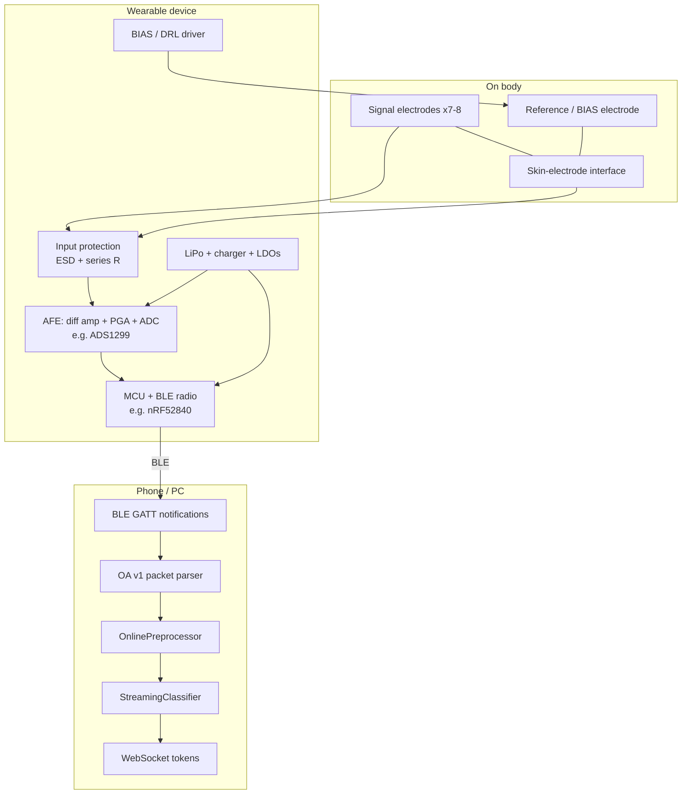

# Block diagram

End-to-end hardware signal path for OpenAlterEgo. Software stages after BLE are implemented in `software/python/openalterego/`.

---

## System overview



---

## Analog signal chain (per channel)

```
Electrode (+) ──┬── series R (100k–1M) ── ESD ── AFE IN+
                │
Electrode (−) ──┴── series R ── ESD ── AFE IN−

Common-mode rejection: differential PGA inside AFE
Patient bias (DRL): averaged electrode drive → reference site
```

**Literature:** Kapur 2018 uses differential face/neck montage; ADS1299 integrates PGA + BIAS ([TI ADS1299 datasheet](https://www.ti.com/product/ADS1299)); SilentWear uses fully differential overlapping pairs without wet reference ([arXiv:2603.02847](https://arxiv.org/abs/2603.02847)).

---

## Digital / transport chain

```
ADC samples (24-bit internal → int16 on wire)
    → MCU ring buffer
    → Pack OA v1 (magic, seq, sample_index, int16 payload)
    → BLE GATT Notify (MTU-sized chunks)
    → Host: parse_oa_v1() → FrameChunk (µV)
    → DSP → ML → TokenEvent → WebSocket JSON
```

**Firmware contract:** `software/python/openalterego/acquisition/packet.py`

| Field | Purpose |
|-------|---------|
| `seq` | Detect reordered/lost BLE notifications |
| `sample_index0` | Gap detection across packets |
| `channels`, `frames` | Parse interleaved int16 payload |
| `AfeSpec` (host-side) | Scale counts → µV (gain, Vref, bits) |

---

## Optional subsystems

| Block | Tier | Literature driver |
|-------|------|-------------------|
| **IMU** (9-axis) | V1+ | Motion artifact regression; Tang 2025 SNR drop under motion |
| **Lead-off detect** | V1+ | ADS1299 built-in; dry electrode contact monitoring |
| **Impedance measure** | V2 | Dry electrode QC ([Sensors 2023.16](https://www.oaepublish.com/articles/ss.2023.16)) |
| **Marker / trigger input** | V0+ | Sync labels during `collect ble` |
| **Bone-conduction output** | V2 | AlterEgo patent — audio feedback without ear occlusion |

---

## Tier mapping

| Subsystem | V0 Benchtop | V1 Wearable PCB | V2 Mechanical |
|-----------|-------------|-----------------|---------------|
| AFE | Dev board (ADS1299 / OpenBCI) | Custom ADS1299 + MCU | Same as V1 |
| Electrodes | Wet Ag/AgCl gel | Dry or gel (iterate) | Integrated in frame |
| Power | Battery + USB isolator for debug | LiPo on-board | Same |
| BLE | Via dev board or USB bridge | nRF52840 native | Same |
| Mechanical | Adhesive patches, manual placement | Cable strain relief | Rigid adjustable arms / band |

See [01-architecture-tiers.md](01-architecture-tiers.md).
